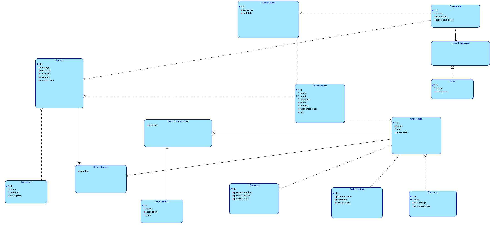
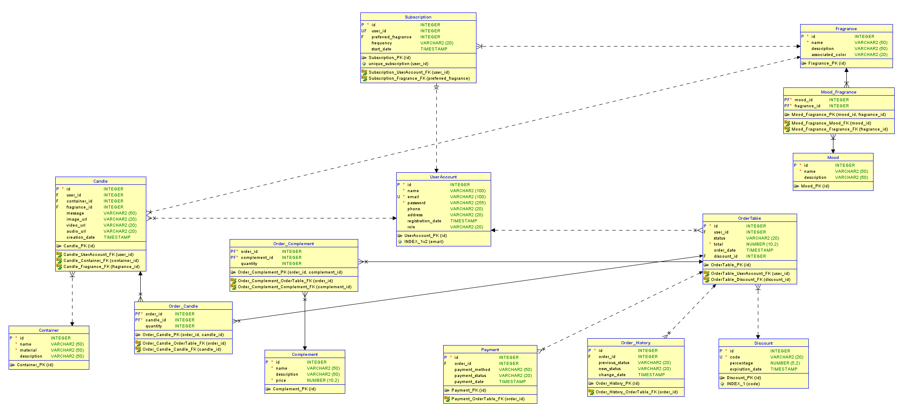

### 📊 Diagrama Logico y Relacional

#### 📌 Diagrama Lógico

#### 📌 Modelo Relacional

# Modelo de Datos

## 🏛 Entidades y Descripción

### 1️⃣ **UserAccount (Usuarios)**
Representa a los usuarios registrados en la plataforma.

| Atributo          | Tipo de Dato   | Descripción |
|-------------------|---------------|-------------|
| `id`             | SERIAL (PK)    | Identificador único del usuario. |
| `name`           | VARCHAR(100)   | Nombre del usuario. |
| `email`          | VARCHAR(100) UNIQUE | Correo electrónico único para autenticación. |
| `password`       | VARCHAR(255)   | Contraseña encriptada del usuario. |
| `phone`          | VARCHAR(20)    | Número de teléfono del usuario. |
| `address`        | TEXT           | Dirección del usuario. |
| `registration_date` | TIMESTAMP DEFAULT CURRENT_TIMESTAMP | Fecha de registro. |
| `role`           | VARCHAR(20) CHECK (customer, admin) | Define si el usuario es administrador o cliente. |

---

### 2️⃣ **Container (Envases de Velas)**
Define los distintos tipos de envases en los que se pueden vender las velas.

| Atributo      | Tipo de Dato   | Descripción |
|--------------|---------------|-------------|
| `id`        | SERIAL (PK)    | Identificador único del envase. |
| `name`      | VARCHAR(50)    | Nombre del envase. |
| `material`  | VARCHAR(50)    | Material del envase (vidrio, cerámica, etc.). |
| `description` | TEXT         | Descripción del envase. |

---

### 3️⃣ **Fragrance (Fragancias)**
Lista de fragancias disponibles para personalizar velas.

| Atributo       | Tipo de Dato   | Descripción |
|---------------|---------------|-------------|
| `id`         | SERIAL (PK)    | Identificador único de la fragancia. |
| `name`       | VARCHAR(50)    | Nombre de la fragancia. |
| `description` | TEXT          | Descripción de la fragancia. |
| `associated_color` | VARCHAR(20) | Color asociado a la fragancia. |

---

### 4️⃣ **Mood (Estados de Ánimo)**
Categoriza fragancias según emociones o estados de ánimo para recomendaciones personalizadas.

| Atributo      | Tipo de Dato   | Descripción |
|--------------|---------------|-------------|
| `id`        | SERIAL (PK)    | Identificador único del estado de ánimo. |
| `name`      | VARCHAR(50)    | Nombre del estado de ánimo (Relajación, Energía, etc.). |
| `description` | TEXT         | Descripción del estado de ánimo. |

---

### 5️⃣ **Mood_Fragrance (Relación entre Estados de Ánimo y Fragancias)**
Define qué fragancias se asocian con qué estados de ánimo.

| Atributo      | Tipo de Dato   | Descripción |
|--------------|---------------|-------------|
| `mood_id`   | INT (FK)       | Referencia a `Mood(id)`. |
| `fragrance_id` | INT (FK)    | Referencia a `Fragrance(id)`. |

---

### 6️⃣ **Candle (Velas Personalizadas)**
Cada vela personalizada creada por un usuario.

| Atributo      | Tipo de Dato   | Descripción |
|--------------|---------------|-------------|
| `id`        | SERIAL (PK)    | Identificador único de la vela. |
| `user_id`   | INT (FK)       | Usuario que creó la vela. |
| `container_id` | INT (FK)    | Tipo de envase usado. |
| `fragrance_id` | INT (FK)    | Fragancia seleccionada. |
| `message`   | TEXT           | Mensaje personalizado en la vela. |
| `image_url` | TEXT           | URL de la imagen en Firebase Storage. |
| `video_url` | TEXT           | URL del video en Firebase Storage. |
| `audio_url` | TEXT           | URL del audio en Firebase Storage. |
| `creation_date` | TIMESTAMP DEFAULT CURRENT_TIMESTAMP | Fecha de creación. |

---

### 7️⃣ **Subscription (Suscripción de Usuarios)**
Gestión de suscripciones a velas periódicas.

| Atributo      | Tipo de Dato   | Descripción |
|--------------|---------------|-------------|
| `id`        | SERIAL (PK)    | Identificador único de la suscripción. |
| `user_id`   | INT (FK)       | Usuario que se suscribió. |
| `preferred_fragrance` | INT (FK) | Fragancia favorita del usuario. |
| `frequency` | VARCHAR(20) CHECK (monthly, bimonthly, quarterly) | Frecuencia de entrega. |
| `start_date` | TIMESTAMP DEFAULT CURRENT_TIMESTAMP | Fecha de inicio de la suscripción. |

---

### 8️⃣ **OrderTable (Pedidos)**
Registra las compras realizadas en la plataforma.

| Atributo      | Tipo de Dato   | Descripción |
|--------------|---------------|-------------|
| `id`        | SERIAL (PK)    | Identificador único del pedido. |
| `user_id`   | INT (FK)       | Usuario que realizó el pedido. |
| `status`    | VARCHAR(20) CHECK (pending, processing, shipped, delivered, canceled) | Estado del pedido. |
| `total`     | DECIMAL(10,2)  | Total a pagar. |
| `order_date` | TIMESTAMP DEFAULT CURRENT_TIMESTAMP | Fecha del pedido. |
| `discount_id` | INT (FK)     | Código de descuento aplicado. |

---

### 9️⃣ **Payment (Pagos)**
Gestiona los pagos de los pedidos.

| Atributo      | Tipo de Dato   | Descripción |
|--------------|---------------|-------------|
| `id`        | SERIAL (PK)    | Identificador único del pago. |
| `order_id`  | INT (FK)       | Pedido asociado. |
| `payment_method` | VARCHAR(50) CHECK (card, transfer, paypal) | Método de pago utilizado. |
| `payment_status` | VARCHAR(20) CHECK (pending, approved, rejected) | Estado del pago. |
| `payment_date` | TIMESTAMP DEFAULT CURRENT_TIMESTAMP | Fecha del pago. |

---

### 🔟 **Order_Candle (Relación entre Pedidos y Velas Personalizadas)**
Define qué velas están en cada pedido.

| Atributo      | Tipo de Dato   | Descripción |
|--------------|---------------|-------------|
| `order_id`  | INT (FK)       | Referencia a `OrderTable(id)`. |
| `candle_id` | INT (FK)       | Referencia a `Candle(id)`. |
| `quantity`  | INT CHECK (quantity > 0) | Cantidad pedida. |

---

